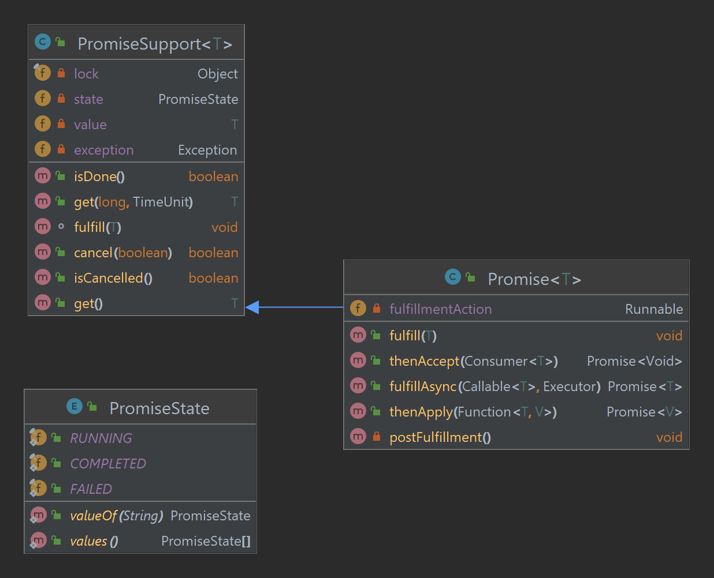

# Promise design pattern
A simple project to demonstrate the promise design pattern for *Advanced design patterns* university course.

## About
The project contains a client and a server application. The client send some messages
to the server, which will "process" them and send them back after a while. The client 
uses the **promise design pattern** to receive the messages.

### Promise pattern UML diagram:

